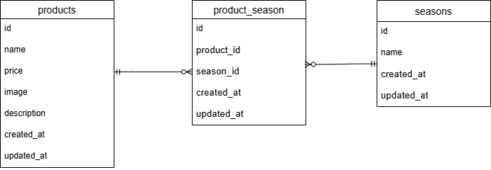

# フルーツ商品管理システム

## 概要

このプロジェクトは、フルーツの商品を管理するためのシステムです。
商品一覧画面、商品詳細画面、商品登録画面を実装しています。
管理者やスタッフが簡単に商品情報を登録・確認・編集できるようになっています。

---

## 環境構築

#### リポジトリをクローン

```
git clone git@github.com:yuki8293/mogitate-test.git
```

#### Laravelのビルド

```
docker-compose up -d --build
```

#### Laravel パッケージのダウンロード

```
docker-compose exec php bash
composer install
exit
```

#### .env ファイルの作成

```
cp .env.example .env
```

#### .env ファイルの修正

```
DB_CONNECTION=mysql
DB_HOST=mysql
DB_PORT=3306
DB_DATABASE=laravel_db
DB_USERNAME=laravel_user
DB_PASSWORD=laravel_pass
```

#### キー生成

```
php artisan key:generate
php artisan storage:link
```

#### マイグレーション・シーディングを実行

```
php artisan migrate --seed
```

## 使用技術（実行環境）

フレームワーク：Laravel 8.x

言語：PHP 8.x

Webサーバー：Nginx 1.21.1

データベース：MySQL 8.0.26

## ER図



## URL

アプリケーション：http://localhost

商品一覧画面：http://localhost/products

phpMyAdmin：http://localhost:8080
